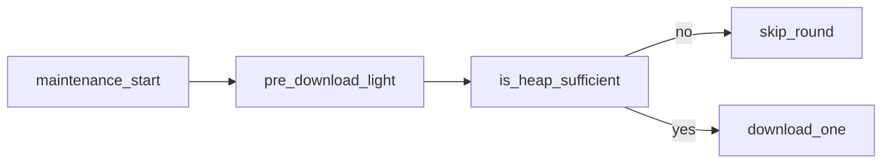

# 音频下载稳定性优化方案 v3（整理版）

## 目标

产出 **《音频下载稳定性优化方案 v3.0》**：在保留 v2 核心原则（不测总空闲而用 `largest`、不设 busy-wait、TLS 减负、串行下载 + 重试）的前提下，把评审中确认的 **流程修正、与现有工程对齐、风险与备选手段** 写进正文，避免实现阶段踩坑。

**建议产出位置（二选一，由你落地时选定）：**

- 用户资料：`d:\Users\10403\Desktop\ararm\方案 音频下载优化_v3.txt`（或 `.md`）
- 或仓库内例如 [`d:/Projects/AI/alarm_esp+app/esp_blufi/blufi/docs/方案_音频下载优化_v3.md`](d:/Projects/AI/alarm_esp+app/esp_blufi/blufi/docs/方案_音频下载优化_v3.md)（若尚无 `docs` 目录需新建）

---

## v3 文档建议目录（相对 v2 的增量）

### 1. 文档头与修订说明

- 标明 **v3.0**、相对 v2 的变更摘要（见下各节）。
- 注明 **目标硬件**：约 520KB RAM、无 PSRAM 场景；与「智能闹钟」任务并存：Wi‑Fi、BluFi、天气/闹钟拉取、LVGL、音频维护。

### 2. 核心原则（保留并小幅增补）

- 保留 v2 四条；**新增一条**：**先可逆释放、再判是否可下** — 避免「未做任何 `pre_download` 就因 `largest` 不足而整轮放弃」。
- **新增一条**：**与现有 `sdkconfig` 去重** — 已存在的项只写「核对合并后 `sdkconfig`」，避免重复劳动与配置冲突。

### 3. Mbed TLS / ESP-TLS（menuconfig）— 与仓库对齐

在方案中显式引用当前工程已具备项（来自 [`sdkconfig.defaults`](d:/Projects/AI/alarm_esp+app/esp_blufi/blufi/sdkconfig.defaults)）：

- 已存在：`CONFIG_MBEDTLS_ASYMMETRIC_CONTENT_LEN`、`CONFIG_MBEDTLS_SSL_IN/OUT_CONTENT_LEN=4096`、`CONFIG_MBEDTLS_DYNAMIC_BUFFER`、`CONFIG_MBEDTLS_SSL_VARIABLE_BUFFER_LENGTH`。
- 已存在：`CONFIG_ESP_TLS_SKIP_SERVER_CERT_VERIFY`（方案中说明：**验链简化后 TLS 峰值仍可能被其它模块占满**，问题未必只剩 TLS）。
- **待核对**：v2 表中的 `CONFIG_MBEDTLS_SSL_PROTO_TLS1_2`、`KEEP_PEER_CERT`、`MAX_CONTENT_LEN`、`SESSION_TICKETS` 等与 **ESP-IDF 对应版本菜单项名称**一致；最终实现以 **编译产物中的 `sdkconfig`** 为准，方案中写明「逐项 diff」。

### 4. 下载前内存整理 `pre_download` — 收敛与风险（重写第三节）

| 手段 | v3 写法 |
|------|--------|
| 全局 `g_device_cloud` HTTP | **不作为默认必做步骤**；改为 **策略选择**：若与其它任务共享长连接，强制 `cleanup` 可能导致重连与更多瞬时分配。推荐 **串行/互斥**（下载期间暂停云端拉取）或 **独立短生命周期 client**。 |
| Wi‑Fi `inactivity_timeout` | **标为待验证**：不保证等价于「回收 RX 缓冲」；v3 中写「需用 `largest` 前后日志验证，无效则从 IDF Wi‑Fi 缓冲相关配置/API 查证」。 |
| LVGL `lv_refr_now` | **标注**：刷新可能短时 **增加** 分配；若采用，应与 `lv_mem_monitor` 一样是 **可开关的诊断路径**，不作为唯一依赖。 |
| `heap_caps_defrag` | **降级为备选**：注明依赖 **ESP-IDF 版本**及对 **internal 堆/fallback** 的实际效果；风险提示：可能影响实时性或并非所有指针可迁移。优先靠 **释放大块 + 错峰**。 |

### 5. `largest` 检查与时序 — 修正 v2 伪代码第四节、第五节）

**必须写入 v3 的修正逻辑**（此前评审结论）：

- **维护任务入口**：先执行一轮 **轻量** `pre_download`（只做确定有益、无副作用或已接受副作用的步骤），再调用 `heap_caps_get_largest_free_block`。
- **循环体内**：对每个待下载文件，可先 **再次轻量清理**（或仅首文件前已做足），避免 v2 中「先 `is_heap_sufficient` 失败则从未执行 `pre_download`」的顺序错误。
- **阈值**：保留「以 `largest` 为主」，将 **16KB** 定位为 **起始建议值**，并写明需 **实测 TLS + `esp_http_client` 峰值** 后校准，可留出 **约 2–4KB** 工程余量（在方案中用文字说明，不写死替代固件常量）。

### 6. 串行下载与重试 — 与 ESP-IDF 错误码对齐

- 保留 v2 **串行 + 每项 `retry_count`/永久失败** 的结构。
- **增补**：临时失败判定须与 **`esp_http_client` 实际返回值**、`esp_tls` 报错路径对照文档或日志归纳；避免硬编码在未验证 IDF 版本上必不触发的 `ESP_ERR_HTTP_*`。
- 明确 **同一轮内**「`largest` 不足则 `break` 剩余项」与 **下一轮维护** 再试的关系（与 v2 一致）。

### 7. 应用层可选优化（新增小节）

- 指向 [`audio_cache_service.c`](d:/Projects/AI/alarm_esp+app/esp_blufi/blufi/main/audio/audio_cache_service.c)：`AUDIO_CACHE_DOWNLOAD_BUFFER_SIZE` 当前为 **2KB** `calloc`；可选 **静态单块复用** 减轻反复 alloc/free 造成的碎片（标为 **可选**，需评估多任务互斥）。

### 8. 与其它网络任务的协调（新增小节）

- 说明 **并发 HTTPS**（天气、闹钟配置、音频）对 `largest` 的叠加效应；推荐策略：**维护窗口内串行化网络 heavy 操作** 或 **互斥锁 + 短延迟重试**（具体策略依你们 `network_task_service` / `playback_task_service` 现状在实现时落代码，方案里只定原则）。

### 9. 测试计划 — 在 v2 第七节上扩展

- 保留 v2 五项；**增加**：**仅音频下载** vs **天气+LVGL 压力并行** 时 `largest` 分布对比；**首次维护**在「先 `pre_download` 再检查」前后 `largest` 差值。

### 10. 预期效果与范围 — 微调

- 保留成功率、兜底响铃等表述；**补充**：效果依赖 **服务器 TLS 记录大小** 与 **现场并发**，需与 **合并后 `sdkconfig` + 实测日志** 绑定，避免过度承诺。

---

## 实施本计划时的操作（非代码改动）

1. 按上述目录撰写 **v3 全文**（中文，表格与伪代码风格可与 v2 保持一致）。
2. 文内 **引用工程路径** 使用完整路径或仓库相对路径，便于评审。
3. 若落地在仓库内，可增加 `docs/README` 索引 **仅当有其它文档惯例**（否则单文件即可）。
